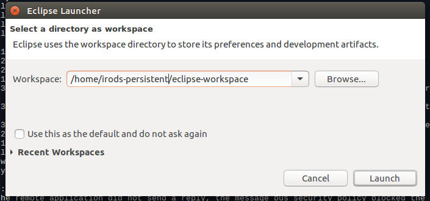
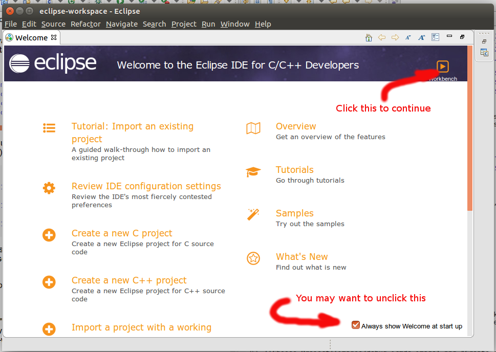
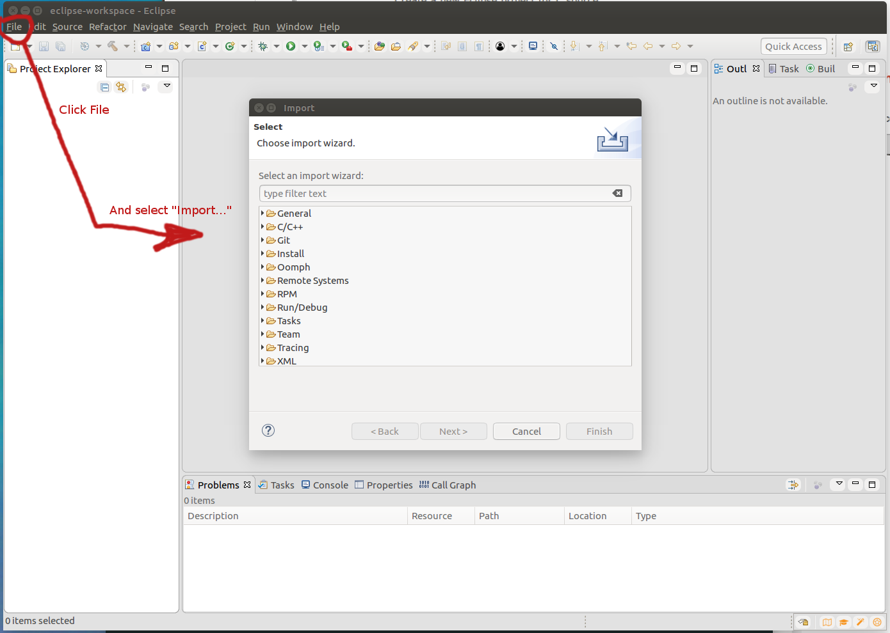
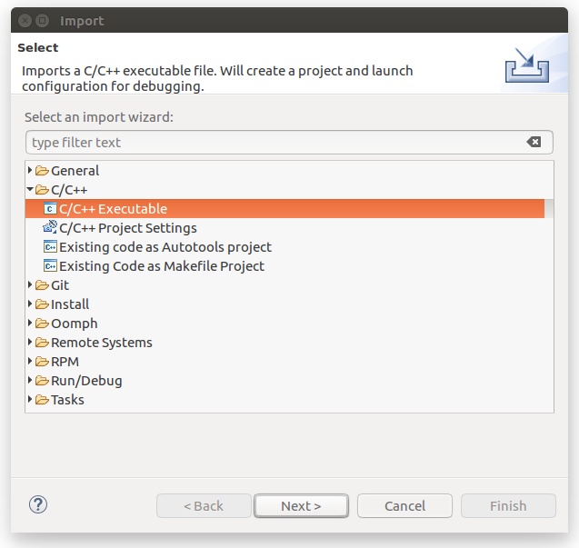
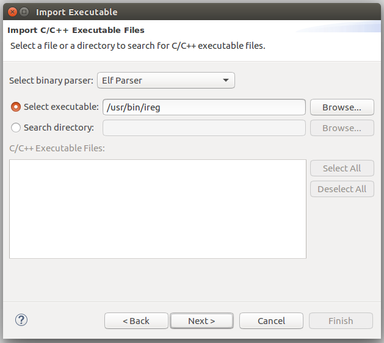
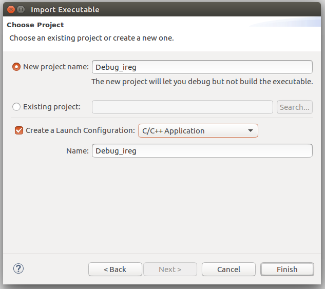
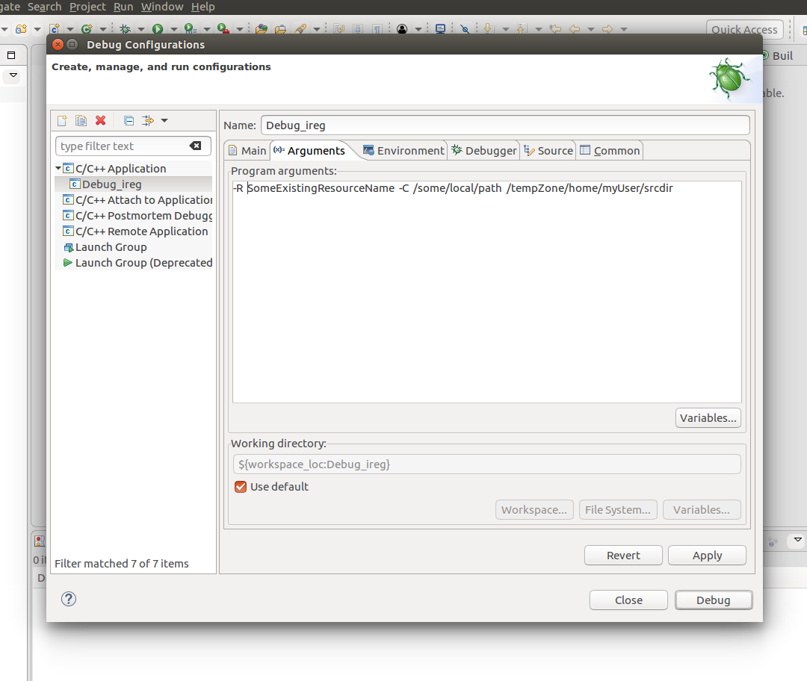
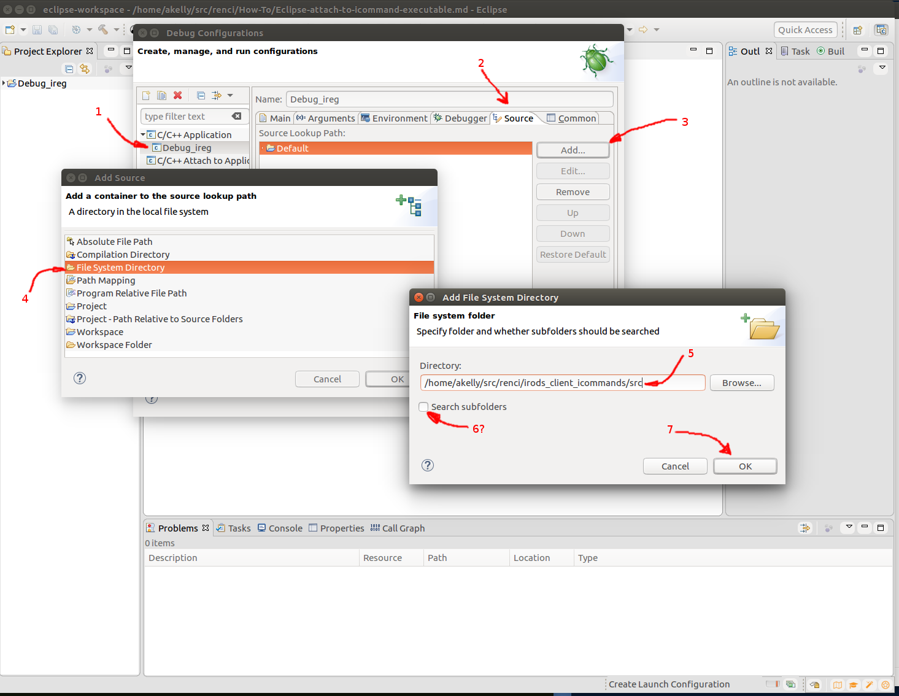
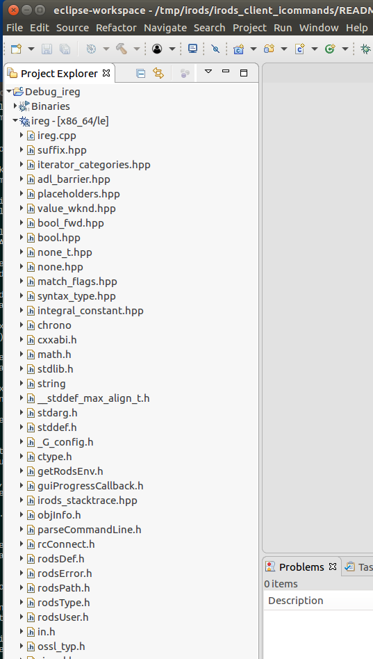
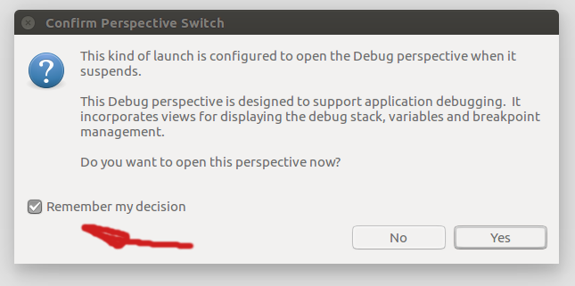

# -- UNDER CONSTRUCTION -- #

# How to Create an Eclipse project for /usr/bin/ireg

This document demonstrates how to create an eclipse project revolving around the **ireg** app executable, which, with the available sources for the project, will allow the developer to start the app, step through code, and examine variable and object values, in short - debug the process.

This operation will not build the ireg app at all, simply debug it.  This can be applied to any of the icommands in /usr/bin.

The eclipse debugger will be run as yourself (the linux user -- "akelly" in my case).  The iRODS user used for this exercise, will be **andrew** (which is a new user to be added to iRODS on this system by the **irods** linux user). There's just a minor setup step needed for that (see below).

### Assumptions & Caveats ###

Before tackling this project, it is recommended that you start with the following if you're not familiar with eclipse:
* Download and setup Eclipse. The version used in the making of this document is *Oxygen*, which bundles the C++ perspective, as well as other related plugins with it:

~~~
		Eclipse IDE for C/C++ Developers
		Version: Oxygen.3 Release (4.7.3RC3)
~~~

* Build a small, simple "hello world" application.  Do a google search of "eclipse tutorial", and you'll find dozens of tutorials and examples, including some pretty good video's on youtube.com.

* Put together your **irods** development environment. See https://github.com/d-w-moore/irods-dev-orientation as a starting point. 

* Go over this HOWTO: [How to Attach Eclipse to a Running Process](https://github.com/andrew-irods/How-To/blob/master/Eclipse-attach-to-running-process.md). 

Lastly, much of what happens next is how I work -- there are many ways to do things, and mine is not necessarily the best for you.  YMMV. 

### Preparations 

Lets assume your developer user name is **akelly**, and that your git repository sources are under the path "/home/akelly/src/renci/".  (In the instructions below, change the "akelly" and "source path below to your own information).

The first task is to get "akelly" set up as an iRODS user. In order to do that we need to establish akelly's **andrew** (iRODS) identity, and use the **iinit** command. 

(Ref: The configuration section of the docs site online [https://docs.irods.org/4.1.2/manual/configuration/](https://docs.irods.org/4.1.2/manual/configuration/).

Follow this process:
 
Become the "irods" user, who has the **rods** (admin) iRODS identity, and who can add the user **andrew** and set some basic paramters:

~~~
akelly@akelly1:~$ sudo su - irods
<password>
irods@akelly1:~$ iadmin mkuser andrew rodsuser
irods@akelly1:~$ iadmin moduser andrew password xx0000
irods@akelly1:~$ exit
akelly@akelly1: $
~~~

So the linux user "akelly" now also has an iRODS user identity called "andrew", with a password (xx0000), and a regular "roduser" profile (run "iiadmin lu andrew" to see all possible types of users).

(Ref: [https://docs.irods.org/4.1.2/icommands/user/#iinit](https://docs.irods.org/4.1.2/icommands/user/#iinit) )

Next, the Linux user **akelly** should run the **iinit** icommand to give iRODS some paramters about us:

As the linux user **akelly**, do the following: run **iinit** (do ignore the initial errors that pop up, and answer the questions):

~~~
akelly@akelly1:~$ iinit
 ERROR: environment_properties::capture: missing environment file. should be \
                 at [/home/andrew/.irods/irods_environment.json]
 One or more fields in your iRODS environment file (irods_environment.json) are
 missing; please enter them.
 Enter the host name (DNS) of the server to connect to: akelly1.europa.renci.org
 Enter the port number: 1247
 Enter your irods user name: andrew
 Enter your irods zone: tempZone
 Those values will be added to your environment file (for use by
 other iCommands) if the login succeeds.

 Enter your current iRODS password: xx0000 
 ~~~

Of the responses given above:

**akelly1.europa.renci.org** -- is the system name for the system as shown on the /etc/hosts line containing the localhost entry (127.0.0.1).

**1247** -- is the default port number for irodsServer
	
**andrew** -- is the chosen iRODS user name for akelly's account, as entered in the previous section.
	
**tempZone** -- Happens to be the default zone.
	
**xx0000** -- Is the password in iRODS for "andrew", as set up by the iiadmin command in the previous step.

At this point, you can check the validity of your linux user **akelly**  configuration by issuing some icommands, and seeing files with the **ils** command.

We are now ready to debug the /usr/bin/ireg command using eclipe, under the linux identity **akelly** (use your own developer linux id).
 

~~~
akelly@akelly1:~$ cd ~akelly/src/renci
akelly@akelly1:~$ ls -l
total 36
drwxrwxr-x  9 akelly akelly 4096 Mar 11 13:21 ./
drwxrwxr-x 15 akelly akelly 4096 Mar 10 16:34 ../
drwxrwxr-x  8 akelly akelly 4096 Mar 12 15:23 bld_irods/
drwxrwxr-x  5 akelly akelly 4096 Mar 12 15:27 bld_irods_client_icommands/
drwxrwxr-x  4 akelly akelly 4096 Mar 10 22:01 How-To/
drwxrwxr-x 15 akelly akelly 4096 Mar 10 21:55 irods/
drwxrwxr-x 10 akelly akelly 4096 Mar 10 22:06 irods_client_icommands/
drwxrwxr-x  5 akelly akelly 4096 Mar 11 13:21 irods_training/
~~~

The sources we want (for /usr/bin/ireg) are in the "irods\_client\_icommands/" folder.  

Now, find the "ireg" executable, and start eclipse still as akelly:

~~~
akelly@akelly1:~$ which ireg
/usr/bin/ireg
akelly@akelly1:~$ /opt/eclipse/eclipse   # Your installation folder might be different.

~~~

At this point, eclipse comes up -- the terminal you invoke it from is waiting for it to exit, and you will see many messages from eclipse.  Those may safely be ignored.

The first thing that happens, is a dialog box that eclipse shows:

 

It suggests to use "/var/lib/irods/eclipse-workspace" as the folder it should use for the workspace.  Override this by updating the path to "/home/irods-persistent/eclipse-workspace", and click "Launch".

The next screen you see is the opening window.  I tend to dismiss that window forever, and go to the actual workbench:

 

Now that the workbench is open, import the executable.  Click "File" --> "Import...":

 

Click on the arrow next to C/C++:
 
 

Choose "C/C++ Executable".  Click "Next". 

 

Type in "/usr/bin/ireg", and click "Next".

 

In the dialog above, you can use the names eclipse sets up, or enter your own, then click "Finish".

The next dialog pops up. This is where you can enter information about the runtime environment for the debugged executable, as well as where the sources are:

First we'll set up the runtime command line parameters.  Click on the "Arguments" tab:

 

The information shown is imaginary of course.  Before we run the debugger for real, we will need to refer to an existing iRODS resource, an existing user directory or file, and a real target. Enter the information, and then click on the "Source" tab:

 

Click and highlight Debug\_ireg.  Click "Add...", pick "File System Directory" from the next dialog box, and finally type in or browse to the source directory for irods_client_icommands.

Click "OK". After the two dialog boxes disappear, click on "Apply" and "Close" on the remaining dialog box.  (Do not click "Debug").

 

Click on the small arrow next to **ireg-[x86_64le]** in the Project Eplorer pane on the left.  This will expand and show the list of source files gathered in the previous step. Opening any one of these files (double-click, for example), will display the source file in the main center-right pane.

### Start the debugger

Right click on the **ireg-[x86_64le]** line in the project explorer, and choose "Debug As   ->", and then pick "Local C/C++ Application".  What opens up is this dialog, asking whether you want to switch from the C/C++ perspective to the Debug perspective.  Choose Yes (you might want to first click on the "Remember my decision" checkbox to avoid getting this dialog box again:

 

What opens up is the Debug Perspective, with the program running, stopped at a breakpoint just inside the main() function:

 

So **ireg** the program is running, under our control.  We are stopped right at the beginning of the program, and shouldn't really continue much further, since the command line parameters entered into Eclipse, were quite imaginary. 

The actual debugging of the program is beyond the scope of this document. 

