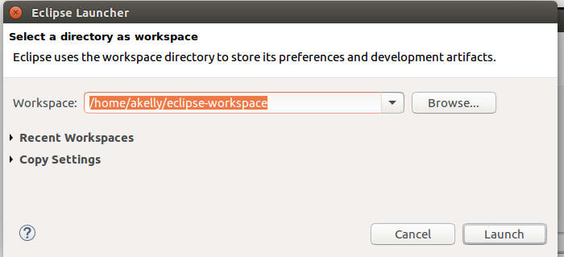
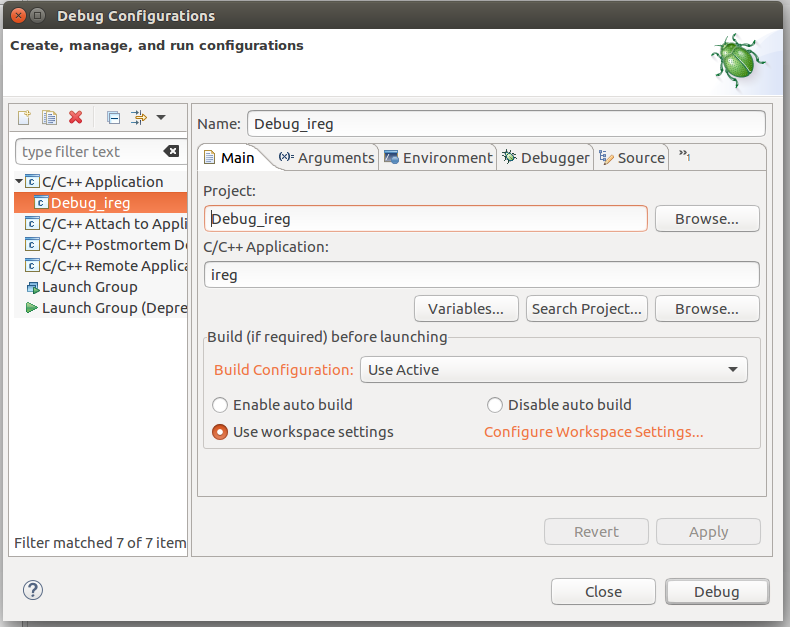
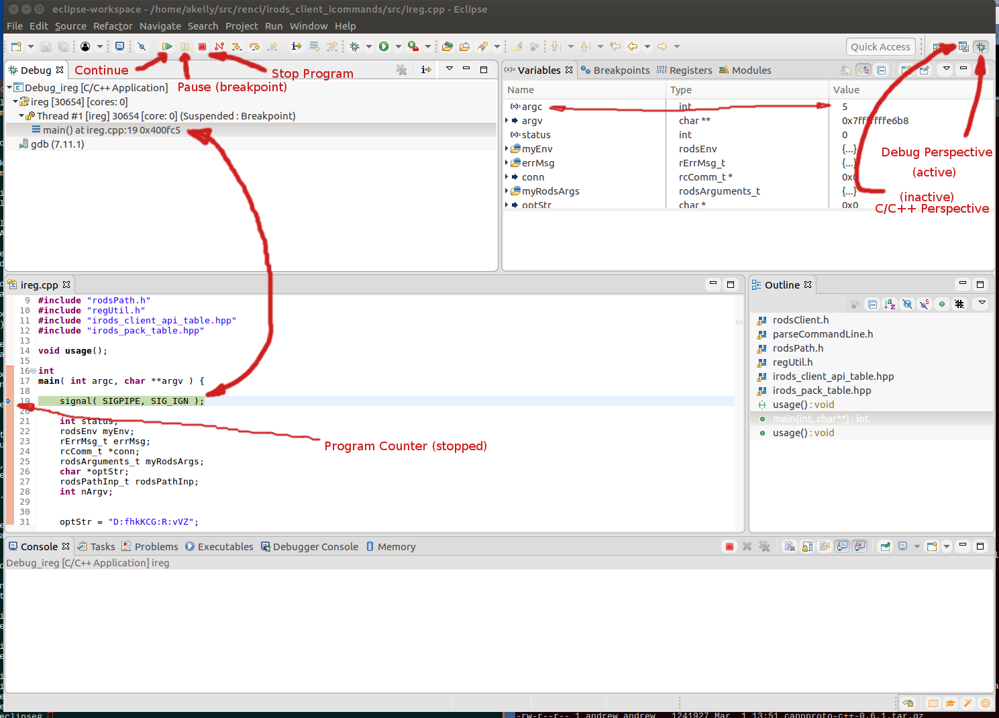

# How to Create an Eclipse project for /usr/bin/ireg

This document demonstrates how to create an eclipse project revolving around the **ireg** app executable, which, with the available sources for the project, will allow the developer to start the app, step through code, and examine variable and object values, in short - debug the process.

This operation will not build the ireg app at all, simply debug it.  This can be applied to any of the icommands in /usr/bin.

The eclipse debugger will be run as the user **irods**.

### The Thing with Eclipse ###
 
In this case, the thing with Eclipse is the same thing as with any debugger for this project -- it should be run as the user **irods**, since that sets up the environment needed for the app to run.

As such, the debugger running as **irods**, will not have ready-made access to the source files which are persumably under the control of git, somewhere on the system, created by another user (you, the developer, not **irods**).

Therefore, unless you change permissions on the files, the user **irods** will not be able to access them.  But **don't change the permissions**, since then git will see every file with modified access as being "changed" and in need of staging, committing, pushing, etc.  So don't do that. 

The solution chosen here is simple.  The icommand sources are simply copied to a different location on disk, but not the **irods** home directory, since that directory can be overwritten during an installation.  Somewhere else, say, /tmp/irods (more on that below).  The sum total of space currently taken up by the *irods_client_icommands/* repository is about 2.5Mb. So this is not a costly exercise in terms of time or space.

### Assumptions & Caveats ###

Before tackling this project, it is recommended that you start with the following if you're not familiar with eclipse:
* Download and setup Eclipse. The version used in the making of this document is *Oxygen*, which bundles the C++ perspective, as well as other related plugins with it:

~~~
		Eclipse IDE for C/C++ Developers
		Version: Oxygen.3 Release (4.7.3RC3)
~~~

* Build a small, simple "hello world" application.  Do a google search of "eclipse tutorial", and you'll find dozens of tutorials and examples, including some pretty good video's on youtube.com.

* Put together your **irods** development environment. See https://github.com/d-w-moore/irods-dev-orientation as a starting point. 

* Go over this HOWTO: [How to Attach Eclipse to a Running Process](https://github.com/andrew-irods/How-To/blob/master/Eclipse-attach-to-running-process.md). 

Lastly, much of what happens next is how I work -- there are many ways to do things, and mine is not necessarily the best for you.  YMMV. 

### Preparations 

 

Temporary text while under construction

 

Temporary text while under construction

 

Temporary text while under construction

 

Temporary text while under construction

 

Temporary text while under construction

 

Temporary text while under construction

 

Temporary text while under construction

 

Temporary text while under construction

 

Temporary text while under construction

 

Temporary text while under construction

 

Temporary text while under construction

 

Temporary text while under construction

However, we are at an end here - we've attached eclipse to a running sources, and for the rest of what's possible here - it's way outside the scope of this document.  Back to the google machine (search for how to debug a program using eclipse).

