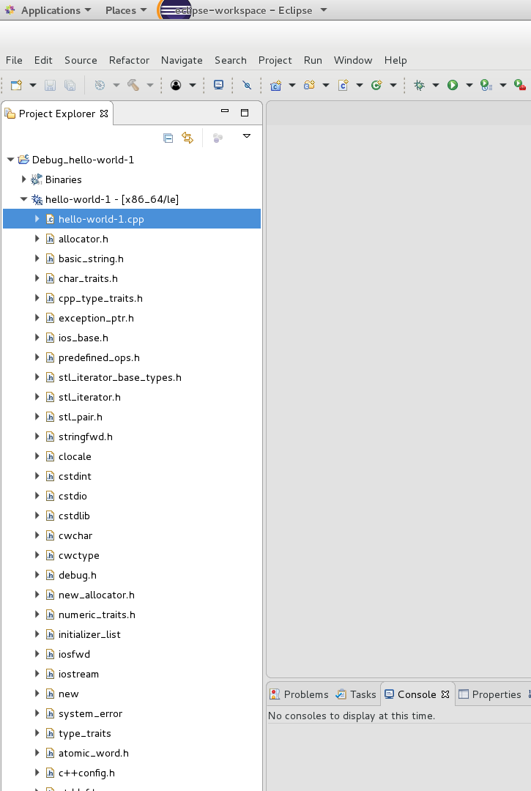

### THIS PAGE IS UNDER CONSTRUCTION -- PLEASE IGNORE FOR NOW ###

# How to Attach Eclipse to a Remote Running iRODS System #

This document demonstrates how to attach the Eclipse IDE to an iRODS system (icommand client and server) on a remote system. 

The local system (**akelly1** in this document) is the development system, and includes a full set of iRODS sources (from github) that are built as a full package build, to provide us with debug objects to install and run on the target remote system (**akellylt1** in this document).  Since both **akelly1** and **akellylt1** are Ubuntu 16.04 systems, the packages we focus on will be .deb files.  An equivalent process for Redhat derived systems (like CentOS, RHEL, etc) would involve .rpm packages.

The connection to the remote system will be based on **ssh**.  It is recommended that ssh keys be installed to avoid being challenged for a password on every connection.  YMMV.

Following the process in this document, we will create an eclipse project that targets an existing icommand linux executable (**iput**), and create a remote debug launch configuration which can launch and debug the utility on a remote system.  We will then create a separate project for the **irodsServer** process as an executable, and then create a remote debug configuration that will allow us to attach eclipse to the remote running **irodsServer** which interacts with our **iput** utility.  None of these Eclipse configurations allows building the actual sources - that's not the intent.  They're used for the purpose of allowing the debugger access to the sources as programs are being debugged.

### The Thing with Eclipse ###
 
Eclipse has many features, configuration options, plugins, and supports different platforms and languages. Not all of them work quite as advertised, and it's easy to get lost. It also has many flavors based on the language perspective chosen. The point is (in my opinion), load up on patience.  

### Assumptions, Caveats and References ###

Before tackling this project, it is recommended that you start with the following knowledge base:

[Installing and running iRODS](https://docs.irods.org/master/getting_started/installation/ "https://docs.irods.org/master/getting_started/installation/")

[Building from source: A guide for developers who want to further work on iRODS](https://github.com/d-w-moore/irods-dev-orientation/blob/master/README.md "https://github.com/d-w-moore/irods-dev-orientation/blob/master/README.md")

**Eclipse How-To's.**  

In fact, we rely on the setup for the projects described below in order to start this project:

[Eclipse Odds and Ends](https://github.com/andrew-irods/How-To/blob/master/Eclipse-notes.md "https://github.com/andrew-irods/How-To/blob/master/Eclipse-notes.md")

[How to Create an Eclipse project for /usr/bin/ireg](https://github.com/andrew-irods/How-To/blob/master/Eclipse-attach-to-icommand-executable.md)

[How to Attach Eclipse to a Running irodsServer Process](https://github.com/andrew-irods/How-To/blob/master/Eclipse-attach-to-irodsServer.md)

**Also, these won't hurt:**

[How to Attach Eclipse to a Running Process](https://github.com/andrew-irods/How-To/blob/master/Eclipse-attach-to-running-process.md "https://github.com/andrew-irods/How-To/blob/master/Eclipse-attach-to-running-process.md")

[Youtube video:  GDB Remote Debugging using LUbuntu Linux and Eclipse CDT Neon 3](https://www.youtube.com/watch?v=KbN1UyybsV4  "https://www.youtube.com/watch?v=KbN1UyybsV4")

### Versions ###

The eclipse version used here is:

~~~
Eclipse IDE for C/C++ Developers
Version: Oxygen.3 Release (4.7.3RC3)
~~~

Running with Oracle Java 9:

~~~
$ java --version
java 9.0.4
Java(TM) SE Runtime Environment (build 9.0.4+11)
Java HotSpot(TM) 64-Bit Server VM (build 9.0.4+11, mixed mode)
~~~

This document assumes sufficient familiarity with Eclipse so that long winded descriptions with screen-shots showing where menus are and how to invoke them are not included.  To find a specific option or menu, examine the referenced How-To's listed above (they are long winded with screen-shots).

### Build and copy all iRODS .deb files to remote system ###

Once we have built the irods server and icommands, we should have two directories, one for each, as well as the corresponding build directories with the results of each build:

(These could be any directory path names):

**..../github/irods** - the directory where the irods server sources were installed (from [iRODS on Github](https://github.com/irods/irods "https://github.com/irods/irods")).

**..../github/bld_irods** - the directory where the artifacts from the build of the irods server reside.

**..../github/irods\_client\_icommands** - the directory where the irods icommand sources were installed (from [iRODS Client iCommands on Github](https://github.com/irods/irods_client_icommands "https://github.com/irods/irods_client_icommands")). 

**..../github/bld_icmds** - the directory where the artifacts from the build of the irods icommands reside. 

Also, there is an expectation here that the remote system (**akellylt1** in this case) has been installed with the standard iRODS packages in a regular configuration.  This includes an iRODS administration user called **irods** which exists on that system with the home directory of **/var/lib/irods** (typically with an unknown password); binaries installed under **/usr/bin**, **/usr/sbin**, **/var/lib/irods/**, etc. 

In preparation of the coming debug session, the target system **akellylt1** should be accessed, a password for the **irods** user added, and ssh keys installed under **~/.ssh/**.

**Note:** There are other ways to do this (for example, logging in as another user who has iRODS admin authority, but for this project we're simply following this process.

For example, access the remote irods system:

~~~
$ ssh andrew@akellylt1             # andrew is a regular linux user with "**sudo**" privileges
# uname -n                         # This is our remote system
akellylt1
$ sudo su
<password>
# passwd irods
<negotiate the new irods password>
# su - irods
$ pwd
/var/lib/irods
$ ./irodsctl status
irodsServer :
  Process 1431
  Process 1432
irodsReServer :
  Process 1434
$ 
~~~

As you can see above, you are logged in as the user **irods**, with the current working directory set at **/var/lib/irods**, and you can proceed with entering ssh keys on both the target system, as well as on your own development system if you wish.

This is a good point in the process to adjust the Yama linux security module ptrace scope variable (ref. [https://www.kernel.org/doc/Documentation/security/Yama.txt](https://www.kernel.org/doc/Documentation/security/Yama.txt)).  While you are still superuser on the target system, do this:

~~~
$ uname -n                         $ This is our remote system
akellylt1
$ whoami
$ irods
$ exit                             $ Go back to being superuser
#
# sysctl kernel.yama.ptrace_scope
kernel.yama.ptrace_scope = 1
#
~~~

If the value displayed is "0", that is the current value of the ptrace_scope variable in the kernel, and you don't have to do anything else.  If it is any other value, do this:

~~~
# sysctl kernel.yama.ptrace_scope=0
kernel.yama.ptrace_scope = 0
#
# exit
$ whoami
andrew
$
~~~

This will allow the debugging session (local or remote) to attach gdb and eclipse to a running server process that's not owned by user in question.  You might have to do this again after the next time the remote system is rebooted. 

Log out from the remote iRODS system (**akellylt1**) and back to your development system at the directory where iRODS was built from source. Of course, you can keep the remote ssh session open, and simply use another window for the local development system -- this might be a good idea, since we still have to install the .deb packages that will be transferred over from the development system:

On the local development system (**akelly1**):

~~~
$ uname -n            # This is our development system
akelly1
$ cd ~/github         # Enter your own base path for the source/build directory
$ ls -l
drwxrwxr-x  5 akelly akelly 4096 Apr 17 10:29 bld_icmds
drwxrwxr-x  8 akelly akelly 4096 Apr 17 10:29 bld_irods
drwxrwxr-x 15 akelly akelly 4096 Apr 14 06:25 irods
drwxrwxr-x 10 akelly akelly 4096 Apr  8 10:39 irods_client_icommands
. . . 
  
~~~
Of course there would be other files and/or directories there in most cases.

Finally, copy and transfer the .deb files from under the two bld_ directories, to the remote iRODS system:

~~~
$ uname -n            # This is our development system
akelly1
$ cd ~/github
$ ls -l bld_icmds/*.deb bld_irods/*.deb
-rw-rw-r-- 1 akelly akelly  3152538 Apr 17 10:29 bld_icmds/irods-icommands_4.2.3~xenial_amd64.deb
-rw-rw-r-- 1 akelly akelly  2657322 Apr 17 10:29 bld_irods/irods-database-plugin-mysql_4.2.3~xenial_amd64.deb
-rw-rw-r-- 1 akelly akelly  2656750 Apr 17 10:29 bld_irods/irods-database-plugin-oracle_4.2.3~xenial_amd64.deb
-rw-rw-r-- 1 akelly akelly  2685302 Apr 17 10:29 bld_irods/irods-database-plugin-postgres_4.2.3~xenial_amd64.deb
-rw-rw-r-- 1 akelly akelly 10481568 Apr 17 10:29 bld_irods/irods-dev_4.2.3~xenial_amd64.deb
-rw-rw-r-- 1 akelly akelly 48034298 Apr 17 10:29 bld_irods/irods-runtime_4.2.3~xenial_amd64.deb
-rw-rw-r-- 1 akelly akelly 19888640 Apr 17 10:29 bld_irods/irods-server_4.2.3~xenial_amd64.deb
$ mkdir packages
$ cp bld_icmds/*.deb bld_irods/*postgres*.deb bld_irods/irods-{dev,runtime,server}*.deb packages
$  
~~~

Notice that we did not copy the packages destined for oracle or mysql based systems -- we are using postgres on the remote system **akellylt1**. Now, lets copy the files to the remote system:

~~~
$ ls -l packages
-rw-rw-r-- 1 akelly akelly  2685302 Apr 19 19:25 irods-database-plugin-postgres_4.2.3~xenial_amd64.deb
-rw-rw-r-- 1 akelly akelly 10481568 Apr 19 19:25 irods-dev_4.2.3~xenial_amd64.deb
-rw-rw-r-- 1 akelly akelly  3152538 Apr 19 19:25 irods-icommands_4.2.3~xenial_amd64.deb
-rw-rw-r-- 1 akelly akelly 48034298 Apr 19 19:25 irods-runtime_4.2.3~xenial_amd64.deb
-rw-rw-r-- 1 akelly akelly 19888640 Apr 19 19:25 irods-server_4.2.3~xenial_amd64.deb
$
$ scp -r packages irods@172.20.0.104:/tmp           # Enter the correct name/ip-address for your system 
irods-icommands_4.2.3~xenial_amd64.deb                                    100% 3079KB   3.0MB/s   00:00    
irods-database-plugin-postgres_4.2.3~xenial_amd64.deb                     100% 2622KB   2.6MB/s   00:00    
irods-dev_4.2.3~xenial_amd64.deb                                          100%   10MB  10.0MB/s   00:00    
irods-server_4.2.3~xenial_amd64.deb                                       100%   19MB  19.0MB/s   00:01    
irods-runtime_4.2.3~xenial_amd64.deb                                      100%   46MB  45.8MB/s   00:00    
$
~~~

You will be challenged for a password if you did not install ssh keys on the remote system.  This operation will place a new directory **/tmp/packages** on the remote system with the .deb files created from the builds of the irods server and icommands.

### Install the iRODS .deb files on the remote system ###

Back on the remote system, become superuser.  You cannot do this as the user **irods** with the **sudo** command, because as installed from packages, this user does not have **sudoer** priviliges.  

In my case, I log in as **andrew** (who does have **sudoer** priviliges) on the remote system, and run the following commands as superuser:

~~~
$ uname -n                     # This is our remote system
akellylt1
$ whoami
andrew
$
$ # First, stop the irods servers:
$
$ sudo su - irods -c "./irodsctl stop"
Stopping iRODS server...
Success
$
$ # Now, install the packages transfered to /tmp/packages, all in one command line:
$
$ sudo dpkg -i /tmp/packages/*.deb
(Reading database ... 267288 files and directories currently installed.)
Preparing to unpack .../irods-database-plugin-postgres_4.2.3~xenial_amd64.deb ...
Unpacking irods-database-plugin-postgres (4.2.3) over (4.2.3) ...
Preparing to unpack .../irods-dev_4.2.3~xenial_amd64.deb ...
Unpacking irods-dev (4.2.3) over (4.2.3) ...
Preparing to unpack .../irods-icommands_4.2.3~xenial_amd64.deb ...
Unpacking irods-icommands (4.2.3) over (4.2.3) ...
Preparing to unpack .../irods-runtime_4.2.3~xenial_amd64.deb ...
Unpacking irods-runtime (4.2.3) over (4.2.3) ...
Preparing to unpack .../irods-server_4.2.3~xenial_amd64.deb ...
No iRODS servers running.
Upgrading Existing iRODS Installation
Unpacking irods-server (4.2.3) over (4.2.3) ...
Setting up irods-dev (4.2.3) ...
Setting up irods-runtime (4.2.3) ...
Setting up irods-icommands (4.2.3) ...
Setting up irods-server (4.2.3) ...
Setting up irods-database-plugin-postgres (4.2.3) ...
Processing triggers for man-db (2.7.5-1) ...
Processing triggers for systemd (229-4ubuntu21.1) ...
Processing triggers for ureadahead (0.100.0-19) ...
ureadahead will be reprofiled on next reboot
Processing triggers for libc-bin (2.23-0ubuntu10) ...
$
$ # Restart the irods servers:
$
$ sudo su - irods -c "./irodsctl start"
Updating /var/lib/irods/VERSION.json...
Validating [/var/lib/irods/.irods/irods_environment.json]... Success
Validating [/var/lib/irods/VERSION.json]... Success
Validating [/etc/irods/server_config.json]... Success
Validating [/etc/irods/host_access_control_config.json]... Success
Validating [/etc/irods/hosts_config.json]... Success
Ensuring catalog schema is up-to-date...
Catalog schema is up-to-date.
Starting iRODS server...
Success
$
~~~

It is important that the "dpkg -i " command executed above be done all in one command line (this allows dpkg to resolve dependencies appropriately).  

Still on the remote system, prepare a small file that can be used as a parameter to the **iput** command in the upcoming eclipse session on the development system.

~~~
$ uname -n                     # This is our remote system
akellylt1
$ whoami
andrew
$ sudo su - irods
[sudo] password for andrew: 
<enter password>
$ whoami
$ irods
$ date > /tmp/testfile1
$ cat /tmp/testfile1
Fri Apr 20 03:07:56 EDT 2018
$ iput /tmp/testfile1
$ ils -l 
/tempZone/home/rods:
  rods              0 demoResc           29 2018-04-20.03:10 & testfile1
$
$ # and remove it from irods...
$
$ irm testfile1
$ ils -l
/tempZone/home/rods:
$
~~~

This small segment above assures us that the irods installation worked fine, and also this is the very same command we will execute remotely from eclipse on the development system.  If it worked here, it should also work there, all things being equal.

### Create an Eclipse Executable Project ###

Everything is now ready on the remote system for our eclipse session. Start eclipse:

~~~
$ uname -n
akelly1
$ /opt/eclipse/eclipse       # Enter your own path to the eclipse executable
. . .
~~~

From the eclipse File menu, pick the "import..." option  (**File --> Import...**). 
A new dialog box opens: 

 

Pick the "C/C++ Executable" option, and click "Next". 
A new dialog box opens: 

 

Click on "Select Executable", find the executable we created up above (hello-world-1), and enter its path.  Click "Next".  A new dialog box opens: 

 

Pick a project name, and name the launch configuration (you can leave the names that Eclipse chose for you if they're reasonable). Click the "Create a Launch Configuration" checkbox, and choose  "C/C++ Attach to Application" from the drop-down menu. 

Click Finish. A new dialog box opens: 

 

Nothing has to change in the Debugger, Source, or Common tabs.  We will add source files to the project in the next step from the project explorer. 

Click "Close". This should take you back to the Project Explorer window: 

 

Click on the small arrow next to "**hello-world-1 - [x86_64le]**" to show the list of sources found for this executables in the previous step.  Notice that the **hello-world-1.cpp** source file is present in the list of files.  You can double-click and edit it, but this project is not geared for building the executable - just running it.

At this point, we can add more source files to the project by telling eclipse to look in additional source folders if needed.  Right-click on the project name in the expolorer pane, and click on the **"Debug As" -->  "Debug Configurations..."** submenus that pop up.
 
A new dialog box opens (the same dialog box we saw above, but with the ability to make changes): 

 

Notice that you can pick additional debug configurations at this point. We'll stick to the **"C/C++ Attach to Application"** configuration for this exercise: Highlight the name of the configuration as shown above, and click the "Source" tab in the right pane.

If you don't see all your sources in the explorer pane on the left (and we do - we just have our hello-world-1.cpp file), you can add source directories for eclipse to look for additional sources. 

Click the **"Add..."** button, and a new dialog box opens: 

 

Pick the "File System Directory" in the "Add Source" dialog, and then enter the full path to the additional folder you want scanned for sources.  Note the "Search subfolders" checkbox at the bottom of the dialog box. 

**For this exercise, we do not need additional source directories scanned by Eclipse, so click Cancel, and return to the main Explorer window.**

### Run the hello-world-1 program ###

Open a "terminal" (aka a shell window).  This can be done inside of eclipse, or outside of it using any terminal or ssh window.  We'll use eclipse for this.  

 

The bottom horizontal pane in the eclipse workspace should have a "Terminal" tab.  If it doesn't, enter "terminal" in the "Quick Access" field on the top right of the workspace.

A list of suggestions pops out. Choose "Commands | Open Local Terminal" to make this tab visible and start a shell going.  Notice that a shell prompt appears within this pane, though not necessarily in the correct directory.  Use "cd" to get to where the executable is, just like you would in any terminal window. 

Start the hello-world-1 program:

 

Focus your cursor within the pane, and click ENTER a couple of times.  You'll notice that the program is now running, and waiting for your next ENTER click.

Time to attach the eclipse debugger to the running program. 

### Attach Eclipse Debugger to the hello-world-1 Program ###
 
At this point, your terminal pane should show the hello-world-1 program waiting for you to click the ENTER key.  Don't do that. We're now going to attach to the running program. 

Right click on the project name in the Project Explorer pane on the left.  From the drop-down menu that shows up, pick "Debug As", and then "Local C/C++ Application" from the second drop-down menu that shows up. A new dialog box then appears:

 

The dialog box contains all the processes currently running, in alphabetized order.  Use the down-arrow to navigate to the "hello-world-1" process (pid = 22631, running single threaded on core# 2 at this time).  Highlight the process (by navigating to it), and click OK.  

The debugger is now started, attached to the running hello-world-1 process, and eclipse switches us from the C/C++ perspective to the Debug perspective:

 to return") 

Notice that we have switched perspectives - everything looks different here. At the top right hand corner of the workspace, there is a highlighted button (debug perspective) which we are currently in.  If we want to do something in the sources while the debugger is running, we can, by switching back to the C/C++ perspective, by clicking on the button to the left of the debug perspective (hover over the button to see what each button is).  We could then go back to the debugger by clicking the debug perspective button. 

As soon as the debugger starts, it pauses all the the running threads in the process (with a breakpoint) - in our case there is a single thread which is paused.  It displays the stack for each thread in the top-left pane, various information (see tabs) in the top-right pane, and the source line equivalent to the paused thread at the top of the stack (which we don't have sources to, as you can see). 

In order to step through our code, and/or set breakpoints, etc - we need to switch to the stack level we want, and that we have sources for.  In this case, it's the bottom of the stack, at hello-world-1.cpp line 12.  So highlight that:

 

There's a lot going on here, now that we are looking at a stack level that we have sources for.  If we continued to step through the code, you could see the program counter progressing through the code, variable values changing, and observe what's happening to the stack.

However, we are at an end here - we've attached eclipse to a running sources, and for the rest of what's possible here - it's way outside the scope of this document.  Back to the google machine (search for how to debug a program using eclipse).

