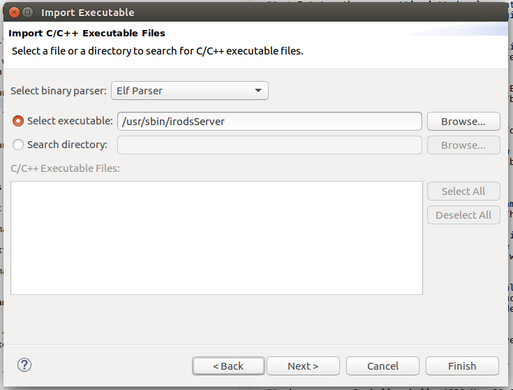

# How to Attach Eclipse to a Running irodsServer Process

Assuming a system with an installed iRODS build (and runtime system), this document demonstrates how to create an Eclipse debug session attached to the running /usr/bin/irodsServer process.

This operation will not build the irodsServer app at all, simply debug it. 

The eclipse debugger will be run as the user **akelly** in this document.  Please use your own linux user name, and enter paths that are appropriate to your system.

### Important Note ###  

The linux system we mostly use for development (Ubuntu, currently it is mostly version 16.04) is installed with a restricted ability for **ptrace** to attach a debugger to a running process.  The security module is called **Yama**, and by default it runs in mode "1", which is a restrictive ability. This configuration will allow your debugger to start, run, or attach to **your** executable (running as a regular process with your linux user-id). In order to attach a debugger to a running server process (see documentation links below), this mode has to be changed to "0" in most cases. This is a run-time kernel configuration parameter set by using **sysctl** as shown below (or by modifying a file under **/proc**). To get the current value of this kernel parameter, do this:

~~~
$ sudo sysctl kernel.yama.ptrace_scope
kernel.yama.ptrace_scope = 1
~~~

If the value "1" is displayed, it should be changed to 0, thusly:

~~~
$ sudo sysctl kernel.yama.ptrace_scope=0
kernel.yama.ptrace_scope = 0
~~~

Then, to verify the change, do this:

~~~
$ sudo sysctl kernel.yama.ptrace_scope
kernel.yama.ptrace_scope = 0
~~~

A useful description of this facility can be found here:  

[https://linux-audit.com/protect-ptrace-processes-kernel-yama-ptrace_scope/](https://linux-audit.com/protect-ptrace-processes-kernel-yama-ptrace_scope/)

A definition of the facility can be found here: 

[https://www.kernel.org/doc/Documentation/security/Yama.txt](https://www.kernel.org/doc/Documentation/security/Yama.txt) 

### Another Important Note ###

Debugging the irodsServer process (any server process, for that matter) carries the risk of mucking up its state (sanity).  Stepping through the code used by one or more threads, can cause inconsistencies and failures within other threads (related to timeouts, or other causes) which create problems a bit later in the server's life.  

It is strongly recommended that after every debug session, the irods runtime environment be restarted. 

### Assumptions & Caveats ###

Before tackling this project, it is recommended that you start with the following if you're not familiar with eclipse:

* Download and setup Eclipse. The version used in the making of this document is *Oxygen*, which bundles the C++ perspective, as well as other related plugins with it:

~~~
		Eclipse IDE for C/C++ Developers
		Version: Oxygen.3 Release (4.7.3RC3)
~~~

* Build a small, simple "hello world" application.  Do a google search of "eclipse tutorial", and you'll find dozens of tutorials and examples, including some pretty good video's on youtube.com.

* Put together your **irods** development environment. See [https://github.com/d-w-moore/irods-dev-orientation](https://github.com/d-w-moore/irods-dev-orientation) as a starting point. 

* Go over this HOWTO: [How to Attach Eclipse to a Running Process](https://github.com/andrew-irods/How-To/blob/master/Eclipse-attach-to-running-process.md). 

* Go over this HOWTO: [How to Create an Eclipse project for /usr/bin/ireg](https://github.com/andrew-irods/How-To/blob/master/Eclipse-attach-to-icommand-executable.md).

* And the iRODS documentation: [https://docs.irods.org](https://docs.irods.org).

Lastly, much of what happens next is how I work -- there are many ways to do things, and mine is not necessarily the best for you.  YMMV. 

### Preparations 

Lets assume your linux developer user name is "akelly", and that your git repository sources are under the path "/home/akelly/src/renci/".  

If you do not have one, create an iRODS identity to use from your linux user account.  (Mine is "andrew", used in the examples below).  See the iRODS documentation for how to create a user (with **iadmin**), and initialize the environment (with **iinit**).

Assuming that eclipse has been successfully installed, and that the sources for **irods** and **icommands** have been successfully built and installed, we are now ready to begin creating an Eclipse debug session which will attach to a running **irodsServer** process. 

As the user **akelly** (use your own developer id and paths please):
~~~
akelly@akellydt1:~$ cd ~akelly/src/renci
akelly@akellydt1:~$ ls -l
total 36
drwxrwxr-x  9 akelly akelly 4096 Mar 11 13:21 ./
drwxrwxr-x 15 akelly akelly 4096 Mar 10 16:34 ../
drwxrwxr-x  8 akelly akelly 4096 Mar 12 15:23 bld_irods/
drwxrwxr-x  5 akelly akelly 4096 Mar 12 15:27 bld_irods_client_icommands/
drwxrwxr-x  4 akelly akelly 4096 Mar 10 22:01 How-To/
drwxrwxr-x 15 akelly akelly 4096 Mar 10 21:55 irods/
drwxrwxr-x 10 akelly akelly 4096 Mar 10 22:06 irods_client_icommands/
drwxrwxr-x  5 akelly akelly 4096 Mar 11 13:21 irods_training/
~~~

The sources we want (for /usr/sbin/irodsServer) are in the "irods/" folder. 

Start eclipse:

~~~
akelly@akellydt1:~$ /opt/eclipse/eclipse   # Your installation folder might be different.

~~~
At this point, eclipse comes up -- the terminal you invoke it from is waiting for it to exit, and you will see many messages from eclipse.  Those may safely be ignored.

The first thing that happens, is a dialog box that eclipse shows:

 

Unless you have some reason to modify it, leave the workspace path as it is.

The next screen you see is the opening window.  I tend to dismiss that window forever, and go to the actual workbench:

 

Now that the workbench is open, import the executable.  Click "File" --> "Import...", and this dialog opens up:

 

Click on the arrow next to C/C++:
 
 

Choose "C/C++ Executable".  Click "Next". 

 

Type in "/usr/sbin/irodsServer", and click "Next".

 

In the dialog above, click on the drop-down menu next to "Create a Launch Configuration:", and pick "C/C++ Attach to Application".  Then, you can use the names eclipse sets up, or enter your own, then click "Finish".

The next dialog pops up. This is where you can enter where the sources are. Click on the "Source" tab:

 

Click the arrow next to "C/C++ Attach to Application", and then and highlight Debug\_irodServer Configuration. Click the "Source" tab.  Then, click "Add...", pick "File System Directory" from the next dialog box, and finally type in or browse to the source directory for irods/.

Click "OK". 

After the two dialog boxes disappear, click on "Apply" and "Close" on the remaining dialog box. (At that point, you could have started debugging by clicking "Debug" after the "Apply" instead of "Close", but we want to demonstrate how to start the debug session on subsequent runs, when there's no need to change this debug configuration).

 

Click on the small arrow next to **irodsServer -[x86_64le]** in the Project Eplorer pane on the left.  This will expand and show the list of source files gathered in the previous step. Opening any one of these files (double-click, for example), will display the source file in the main center-right pane.

### Start the debugger

Open the "Run" menu from the top title-bar. Choose "Debug As..." (or, you can get the same thing by right clicking the **irodsServer-[x86_64le]** line in the project explorer, and choosing "Debug As   ->"), and then pick "Local C/C++ Application".  (An alternative is to go into "Debug Configurations..." in click "Debug" there).  The next dialog box will allow you to choose which running process to attach to:

 

There is more to be said about which specific irodsServer process you need to attach to. There are at least two, but there may be dozens.  The specific PID to attach to can be found in the irods logs, but we're not going to cover that here. 

For the purpose of this exercise, click one of the irodsServer processes (say PID# 2421), and click "OK".

**Potential Error**

If for some reason the attempt by eclipse to attach to the process you chose fails, this would be the point at which it shows up.  For example: 

 

This may be an irodsServer process which is in a bad state because of previous debug operations.  Restart the irods environment to fix the problem. Then, restart your debug session as described above.
 
Or, this could be a manifestation of the ptrace failure described in the **Important Note** section outlined at the beginning of this document.  To recover, follow the process shown there, and restart your debug session as described above. 

**Next step**

After attaching to the running process, what opens up is this dialog, asking whether you want to switch from the C/C++ perspective to the Debug perspective.  Choose Yes (you might want to first click on the "Remember my decision" checkbox to avoid getting this dialog box again:

 

What opens up is the Debug Perspective, with irodsServer running, with all threads stopped:

 

You can see one of the suspended threads showing it's call stack, with the breakpoint typically at a select() call, waiting for network events.

**It is probably important to just press the green arrow on the top bar to allow the server to continue running at this point, to prevent timeout issues from corrupting the state of the server.**

However, we want to take another look at what's going on, so we'll stay paused so we can see the next screen:

Notice that we've gone down one frame in the stack trace (top left pane).  To do this, click on the line you want to view sources for. Since this (rodsServer.cpp line# 499) is the highest stack level for which we have sources, this is the one we pick. 

The left pane opens up to that source file, at line 499, and we see that we are indeed at a select() system call, waiting for a network event. 

The actual debugging of the program is beyond the scope of this document. 

