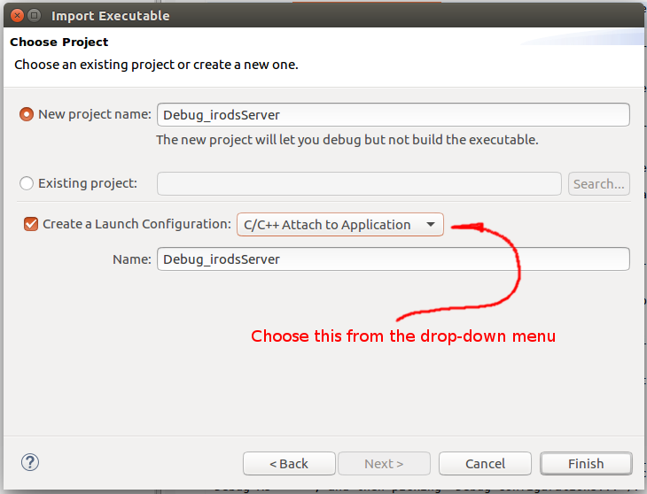

# How to Attach Eclipse to a Running irodsServer Process

Assuming a system with an installed iRODS build (and runtime system), this document demonstrates how to create an Eclipse debug session attached to the running /usr/bin/irodsServer process.

This operation will not build the irodsServer app at all, simply debug it. 

The eclipse debugger will be run as the user **akelly** in this document.  Please use your own linux user name, and enter paths that are appropriate to your system.

### Important Note ###  

The linux system we mostly use for development (Ubuntu, currently it is mostly version 16.04) is installed with a restricted ability for **ptrace** to attach a debugger to a running process.  The security module is called **Yama**, and by default it runs in mode "1", which is a restrictive ability. This configuration will allow your debugger to start, run, or attach to **your** executable (running as a regular process with your linux user-id). In order to attach a debugger to a running server process (see documentation links below), this mode has to be changed to "0" in most cases. This is a run-time configuration set by modifying a file under **/proc**:

~~~
root@akellydt1:/home/akelly/src/renci/How-To/images# sysctl kernel.yama.ptrace_scope=0
kernel.yama.ptrace_scope = 0
root@akellydt1:/home/akelly/src/renci/How-To/images# sysctl kernel.yama.ptrace_scope
kernel.yama.ptrace_scope = 0

$ sudo echo 0 > /proc/sys/kernel/yama/ptrace_scope
~~~

You can verify the configuration by running:

~~~
akelly@akellydt1:~$ sudo sysctl kernel.yama.ptrace_scope
kernel.yama.ptrace_scope = 0
~~~

A useful description of this facility can be found here:  

[https://linux-audit.com/protect-ptrace-processes-kernel-yama-ptrace_scope/](https://linux-audit.com/protect-ptrace-processes-kernel-yama-ptrace_scope/)

A definition of the facility can be found here: 

[https://www.kernel.org/doc/Documentation/security/Yama.txt](https://www.kernel.org/doc/Documentation/security/Yama.txt) 

### Assumptions & Caveats ###

Before tackling this project, it is recommended that you start with the following if you're not familiar with eclipse:

* Download and setup Eclipse. The version used in the making of this document is *Oxygen*, which bundles the C++ perspective, as well as other related plugins with it:

~~~
		Eclipse IDE for C/C++ Developers
		Version: Oxygen.3 Release (4.7.3RC3)
~~~

* Build a small, simple "hello world" application.  Do a google search of "eclipse tutorial", and you'll find dozens of tutorials and examples, including some pretty good video's on youtube.com.

* Put together your **irods** development environment. See [https://github.com/d-w-moore/irods-dev-orientation](https://github.com/d-w-moore/irods-dev-orientation) as a starting point. 

* Go over this HOWTO: [How to Attach Eclipse to a Running Process](https://github.com/andrew-irods/How-To/blob/master/Eclipse-attach-to-running-process.md). 

* Go over this HOWTO: [How to Create an Eclipse project for /usr/bin/ireg](https://github.com/andrew-irods/How-To/blob/master/Eclipse-attach-to-icommand-executable.md).

* And the iRODS documentation: [https://docs.irods.org](https://docs.irods.org).

Lastly, much of what happens next is how I work -- there are many ways to do things, and mine is not necessarily the best for you.  YMMV. 

### Preparations 

Lets assume your linux developer user name is "akelly", and that your git repository sources are under the path "/home/akelly/src/renci/".  

If you do not have one, create an iRODS identity to use from your linux user account.  (Mine is "andrew", used in the examples below).  See the iRODS documentation for how to create a user (with **iadmin**), and initialize the environment (with **iinit**).

Assuming that eclipse has been successfully installed, and that the sources for **irods** and **icommands** have been successfully built and installed, we are now ready to begin creating an Eclipse debug session which will attach to a running **irodsServer** process. 

As the user **akelly** (use your own developer id and paths please):
~~~
akelly@akellydt1:~$ cd ~akelly/src/renci
akelly@akellydt1:~$ ls -l
total 36
drwxrwxr-x  9 akelly akelly 4096 Mar 11 13:21 ./
drwxrwxr-x 15 akelly akelly 4096 Mar 10 16:34 ../
drwxrwxr-x  8 akelly akelly 4096 Mar 12 15:23 bld_irods/
drwxrwxr-x  5 akelly akelly 4096 Mar 12 15:27 bld_irods_client_icommands/
drwxrwxr-x  4 akelly akelly 4096 Mar 10 22:01 How-To/
drwxrwxr-x 15 akelly akelly 4096 Mar 10 21:55 irods/
drwxrwxr-x 10 akelly akelly 4096 Mar 10 22:06 irods_client_icommands/
drwxrwxr-x  5 akelly akelly 4096 Mar 11 13:21 irods_training/
~~~

The sources we want (for /usr/sbin/irodsServer) are in the "irods/" folder. 

Start eclipse:

~~~
akelly@akellydt1:~$ /opt/eclipse/eclipse   # Your installation folder might be different.

~~~
At this point, eclipse comes up -- the terminal you invoke it from is waiting for it to exit, and you will see many messages from eclipse.  Those may safely be ignored.

The first thing that happens, is a dialog box that eclipse shows:

 

Unless you have some reason to modify it, leave the workspace path as it is.

The next screen you see is the opening window.  I tend to dismiss that window forever, and go to the actual workbench:

 

Now that the workbench is open, import the executable.  Click "File" --> "Import...", and this dialog opens up:

 

Click on the arrow next to C/C++:
 
 

Choose "C/C++ Executable".  Click "Next". 

 

Type in "/usr/sbin/irodsServer", and click "Next".

 

In the dialog above, click on the drop-down menu next to "Create a Launch Configuration:", and pick "C/C++ Attach to Application".  Then, you can use the names eclipse sets up, or enter your own, then click "Finish".

The next dialog pops up. This is where you can enter where the sources are. Click on the "Source" tab:

 

Click the arrow next to "C/C++ Attach to Application", and then and highlight Debug\_irodServer Configuration. Click the "Source" tab.  Then, click "Add...", pick "File System Directory" from the next dialog box, and finally type in or browse to the source directory for irods/.

Click "OK". 

After the two dialog boxes disappear, click on "Apply" and "Close" on the remaining dialog box.  (Do not click "Debug").

 

Click on the small arrow next to **irodsServer -[x86_64le]** in the Project Eplorer pane on the left.  This will expand and show the list of source files gathered in the previous step. Opening any one of these files (double-click, for example), will display the source file in the main center-right pane.

### Start the debugger

Open the "Run" menu from the top title-bar. Choose "Debug Configurations..." (or, you can get the same thing by right clicking the **irodsServer-[x86_64le]** line in the project explorer, and choosing "Debug As   ->", and then picking "Debug Configurations..."):  

 

Click the small arrow next to "C/C++ Attach to Application" if that section is not open, and then highlight (click on) the "Debug_irodsServer Configuration" line. Click Debug button.

What opens up is this dialog, asking whether you want to switch from the C/C++ perspective to the Debug perspective.  Choose Yes (you might want to first click on the "Remember my decision" checkbox to avoid getting this dialog box again:

 

What opens up is the Debug Perspective, with the program running, stopped at a breakpoint just inside the main() function:

 

So **ireg** the program is running, under our control.  We are stopped right at the beginning of the program, and shouldn't really continue much further, since the command line parameters entered into Eclipse, were quite imaginary. 

The actual debugging of the program is beyond the scope of this document. 

