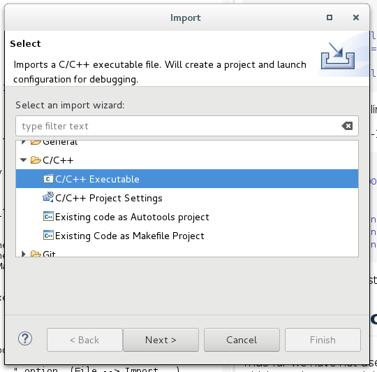
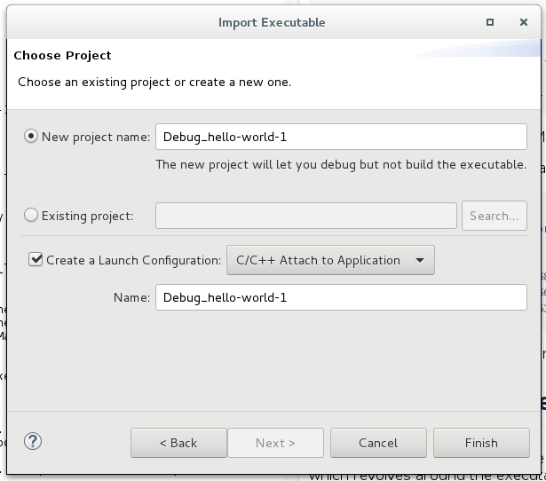

# How to Attach Eclipse to a Running Process

This document demonstrates how to attach the Eclipse IDE to a running process. We will first create an eclipse project that targets an existing linux executable, and create a debug launch configuration which attaches the project to a running executable.

### The Thing with Eclipse ###
 
Eclipse has many features, configuration options, plugins, and supports different platforms and languages. Not all of them work quite as advertised, and it's easy to get lost. It also has many flavors based on the language perspective chosen. The point is (in my opinion), load up on patience.  

### Assumptions & Caveats ###

Before tackling this project, it is recommended that you start with the following if you're not familiar with eclipse:
* Download and setup Eclipse. The version used in the making of this document is *Oxygen*, which bundles the C++ perspective, as well as other related plugins with it:

~~~
		Eclipse IDE for C/C++ Developers
		Version: Oxygen.2 Release (4.7.2)
~~~

* Build a small, simple "hello world" application.  Do a google search of "eclipse tutorial", and you'll find dozens of tutorials and examples, including some pretty good video's on youtube.com.

* This how-to document really starts when you have an executable that has been built (it does not have to have been built with Eclipse for this exercise) in debug mode (-g -O0 compiler flags), and to which you know where the sources are.

Lastly, much of what happens next is how I work -- there are many ways to do things, and mine is not necessarily the best for you.  YMMV. 

### Create a simple "hello world" App

For the purpose of this exercise, we're simply going to create a folder with a single Makefile and .cpp file in it - not necessarily in Eclipse:

~~~
	$ mkdir hello-world-1
	$ cd hello-world-1
	$ vi hello-world-1.cpp     # or use your favorite editor.
~~~
Create the following content in hello-world-1.cpp:

~~~
#include <stdio.h>
#include <iostream>
#include <string>

int main(int argc, char **argv)
{
    int i = 1;
    std::string line;

    do {
        std::cout << "Please press ENTER (or ctl^d for EOF): " << std::flush;
        if (!std::getline((std::cin), line)) {
            break;
        }
        std::cout << "Hello world no. " << i << "!!!" << std::endl;
        i++;
    } while (true);
    
    std::cout << std::endl;
    return 0;
}
~~~

When the program is run, it will echo a line to standard output every time RETURN is hit on the keyboard.  Since it runs until you enter EOF (ctrl^d), it's a good (easy) candidate to attach eclipse to at runtime.  

Now, create the following content in Makefile:

~~~
all: app

app:        hello-world-1.cpp
            g++ --std=c++14 -g -O0 hello-world-1.cpp -o hello-world-1
clean:
            rm -f hello-world-1
~~~

Don't forget that the delimiter in Makefile is the tab (\t) character, or you will get syntax errors. This Makefile will create a single configuration in Debug mode (-g -O0, and the symbols are not stripped from the executable).  When you use Eclipse as a proper IDE, it will have two build modes: Debug and non-Debug (release) modes that you can build and run with.  But that's not important for this exercise.  We just want a debug executable.

Creating the hello-world-1 executable is simply a matter of:

~~~
$ make
g++ --std=c++14 -g -O0 hello-world-1.cpp -o hello-world-1
$ ls -l
total 68
-rwxr-xr-x 1 andrew andrew 60168 Mar  6 13:55 hello-world-1
-rw-r--r-- 1 andrew andrew   266 Mar  6 11:53 hello-world-1.cpp
-rw-r--r-- 1 andrew andrew   153 Mar  6 11:44 Makefile
~~~

So we're now ready to start working with the executable (./hello-world-1):

### Create an Eclipse Executable Project ###

Thus far we have not used eclipse for anything.  We're going to now create an eclipse project which revolves around the executable above (./hello-world-1).   

From the eclipse File menu, pick the "import..." option  (**File --> Import...**). 
A new dialog box opens: 

 

Pick the "C/C++ Executable" option, and click "Next". 
A new dialog box opens: 

 

Click on "Select Executable", find the executable we created up above (hello-world-1), and enter its path.  Click "Next".  A new dialog box opens: 

 

Pick a project name, and name the launch configuration (you can leave the names that Eclipse chose for you if they're reasonable). Click the "Create a Launch Configuration" checkbox, and choose  "C/C++ Attach to Application" from the drop-down menu. 

Click Finish. A new dialog box opens: 

 

Nothing has to change in the Debugger, Source, or Common tabs.  We will add source files to the project in the next step from the project explorer. 

Click "Close". This should take you back to the Project Explorer window: 

 

Click on the small arrow next to "**hello-world-1 - [x86_64le]**" to show the list of sources found for this executables in the previous step.  Notice that the **hello-world-1.cpp** source file is present in the list of files.  You can double-click and edit it, but this project is not geared for building the executable - just running it.

At this point, we can add more source files to the project by telling eclipse to look in additional source folders if needed.  Right-click on the project name in the expolorer pane, and click on the **"Debug As" -->  "Debug Configurations..."** submenus that pop up.
 
A new dialog box opens (the same dialog box we saw above): 

 

Notice that you can pick additional debug configurations at this point. We'll stick to the **"C/C++ Attach to Application"** configuration for this exercise: Highlight the name of the configuration as shown above, and click the "Source" tab in the right pane.

If you don't see all your sources in the explorer pane on the left (and we do - we just have our hello-world-1.cpp file), you can add source directories for eclipse to look for additional sources. 

Click the **"Add..."** button, and a new dialog box opens: 

 

Pick the "File System Directory" in the "Add Source" dialog, and then enter the full path to the additional folder you want scanned for sources.  Note the "Search subfolders" checkbox at the bottom of the dialog box. 

**For this exercise, we do not need additional source directories scanned by Eclipse, so click Cancel, and return to the main Explorer window.**

### Run the hello-world-1 program ###

Open a "terminal" (aka a shell window).  This can be done inside of eclipse, or outside of it using any terminal or ssh window.  We'll use eclipse for this.  

 

The bottom horizontal pane in the eclipse workspace should have a "Terminal" tab.  If it doesn't, enter "terminal" in the "Quick Access" field on the top right of the workspace.

A list of suggestions pops out. Choose "Commands | Open Local Terminal" to make this tab visible and start a shell going.  Notice that a shell prompt appears within this pane, though not necessarily in the correct directory.  Use "cd" to get to where the executable is, just like you would in any terminal window. 

Start the hello-world-1 program:

 

Focus your cursor within the pane, and click ENTER a couple of times.  You'll notice that the program is now running, and waiting for your next ENTER click.

Time to attach the eclipse debugger to the running program. 

### Attach Eclipse Debugger to the hello-world-1 Program ###
 
At this point, your terminal pane should show the hello-world-1 program waiting for you to click the ENTER key.  Don't do that. We're now going to attach to the running program. 

Right click on the project name in the Project Explorer pane on the left.  From the drop-down menu that shows up, pick "Debug As", and then "Local C/C++ Application" from the second drop-down menu that shows up. A new dialog box then appears:

 

The dialog box contains all the processes currently running, in alphabetized order.  Use the down-arrow to navigate to the "hello-world-1" process (pid = 22631, running single threaded on core# 2 at this time).  Highlight the process (by navigating to it), and click OK.  

The debugger is now started, attached to the running hello-world-1 process, and eclipse switches us from the C/C++ perspective to the Debug perspective:

 to return") 

Notice that we have switched perspectives - everything looks different here. At the top right hand corner of the workspace, there is a highlighted button (debug perspective) which we are currently in.  If we want to do something in the sources while the debugger is running, we can, by switching back to the C/C++ perspective, by clicking on the button to the left of the debug perspective (hover over the button to see what each button is).  We could then go back to the debugger by clicking the debug perspective button. 

As soon as the debugger starts, it pauses all the the running threads in the process (with a breakpoint) - in our case there is a single thread which is paused.  It displays the stack for each thread in the top-left pane, various information (see tabs) in the top-right pane, and the source line equivalent to the paused thread at the top of the stack (which we don't have sources to, as you can see). 

In order to step through our code, and/or set breakpoints, etc - we need to switch to the stack level we want, and that we have sources for.  In this case, it's the bottom of the stack, at hello-world-1.cpp line 12.  So highlight that:

 

There's a lot going on here, now that we are looking at a stack level that we have sources for.  If we continued to step through the code, you could see the program counter progressing through the code, variable values changing, and observe what's happening to the stack.

However, we are at an end here - we've attached eclipse to a running sources, and for the rest of what's possible here - it's way outside the scope of this document.  Back to the google machine (search for how to debug a program using eclipse).

