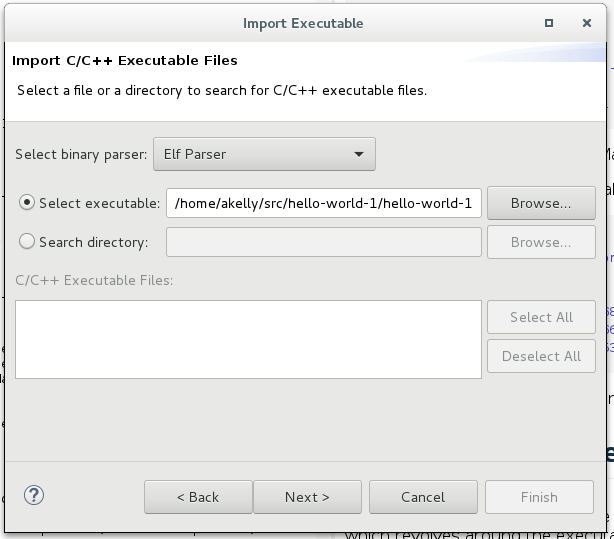

# How to Attach Eclipse to a Running Process

This document demonstrates how to attach the Eclipse IDE to a running process. We will first create an eclipse project that targets an existing linux executable, and create a debug launch configuration which attaches the project to a running executable.

### The Thing with Eclipse ###
 
Eclipse has many features, configuration options, plugins, and supports different platforms and languages. Not all of them work quite as advertised, and it's easy to get lost. It also has many flavors based on the language perspective chosen. The point is (in my opinion), load up on patience.  

### Assumptions & Caveats ###

Before tackling this project, it is recommended that you start with the following if you're not familiar with eclipse:
* Download and setup Eclipse. The version used in the making of this document is *Oxygen*, which bundles the C++ perspective, as well as other related plugins with it:

~~~
		Eclipse IDE for C/C++ Developers
		Version: Oxygen.2 Release (4.7.2)
~~~

* Build a small, simple "hello world" application.  Do a google search of "eclipse tutorial", and you'll find dozens of tutorials and examples, including some pretty good video's on youtube.com.

* This how-to document really starts when you have an executable that has been built (it does not have to have been built with Eclipse for this exercise) in debug mode (-g -O0 compiler flags), and to which you know where the sources are.

Lastly, much of what happens next is how I work -- there are many ways to do things, and mine is not necessarily the best for you.  YMMV. 

### Create a simple "hello world" App

For the purpose of this exercise, we're simply going to create a folder with a single Makefile and .cpp file in it - not necessarily in Eclipse:

~~~
	$ mkdir hello-world-1
	$ cd hello-world-1
	$ vi hello-world-1.cpp     # or use your favorite editor.
~~~
Create the following content in hello-world-1.cpp:

~~~
#include <stdio.h>
#include <iostream>
#include <string>

int main(int argc, char **argv)
{
    int i = 1;
    std::string line;

    do {
        std::cout << "Please press ENTER (or ctl^d for EOF): " << std::flush;
        if (!std::getline((std::cin), line)) {
            break;
        }
        std::cout << "Hello world no. " << i << "!!!" << std::endl;
        i++;
    } while (true);
    return 0;
}
~~~

When the program is run, it will echo a line to standard output every time RETURN is hit on the keyboard.  Since it runs until you enter EOF (ctrl^d), it's a good (easy) candidate to attach eclipse to at runtime.  

Now, create the following content in Makefile:

~~~
all: app

app:        hello-world-1.cpp
            g++ --std=c++14 -g -O0 hello-world-1.cpp -o hello-world-1
clean:
            rm -f hello-world-1
~~~

Don't forget that the delimiter in Makefile is the tab (\t) character, or you will get syntax errors. This Makefile will create a single configuration in Debug mode (-g -O0, and the symbols are not stripped from the executable).  When you use Eclipse as a proper IDE, it will have two build modes: Debug and non-Debug (release) modes that you can build and run with.  But that's not important for this exercise.  We just want a debug executable.

Creating the hello-world-1 executable is simply a matter of:

~~~
$ make
g++ --std=c++14 -g -O0 hello-world-1.cpp -o hello-world-1
$ ls -l
total 68
-rwxr-xr-x 1 andrew andrew 60168 Mar  6 13:55 hello-world-1
-rw-r--r-- 1 andrew andrew   266 Mar  6 11:53 hello-world-1.cpp
-rw-r--r-- 1 andrew andrew   153 Mar  6 11:44 Makefile
~~~

So we're now ready to start working with the executable (./hello-world-1):

### Create an Eclipse Executable Project ###

Thus far we have not used eclipse for anything.  We're going to now create an eclipse project which revolves around the executable above (./hello-world-1).   

From the eclipse File menu, pick the "import..." option  (**File --> Import...**). 
A new dialog box opens: 

 

Pick the "C/C++ Executable" option, and click "Next". 
A new dialog box opens: 

 

Click on "Select Executable", find the executable we created up above (hello-world-1), and enter its path.  Click "Next".  A new dialog box opens: 

 

Pick a project name, and name the launch configuration (you can leave the names that Eclipse chose for you if they're reasonable). Click the "Create a Launch Configuration" checkbox, and choose  "C/C++ Attach to Application" from the drop-down menu. 

Click Finish. A new dialog box opens: 

 

Nothing should change in the Debugger, Source, or Common tabs.  Notice that under the sources tab, you cannot modify anything at this point. This can be done in the next step from the project explorer. 

Click "Close". This should take you back to the Project Explorer window: 

 

Click on the small arrow next to "**hello-world-1 - [x86_64le**" to show the list of sources found for this executables in the previous step.  Notice that the **hello-world-1.cpp** source file is present in the list of files.  You can double-click and edit it, but this project is not geared for building the executable - just running it.

At this point, we can add more source files to the project by telling eclipse to look in additional source folders if needed.  Right-click on the project name in the expolorer pane, and click on the **"Debug As" -->  "Debug Configurations..."** submenus that pop up.
 
A new dialog box opens (the same dialog box we saw above, but with the ability to make changes): 

 

Notice that you can pick additional debug configurations at this point. We'll stick to the **"C/C++ Attach to Application"** configuration for this exercise: Highlight the name of the configuration as shown above, and click the "Source" tab in the right pane.

If you don't see all your sources in the explorer pane on the left (and we do - we just have our hello-world-1.cpp file), you can add source directories for eclipse to look for additional sources. 

Click the **"Add..."** button, and a new dialog box opens: 

 

Pick the "File System Directory" in the "Add Source" dialog, and then enter the full path to the additional folder you want scanned for sources.  Note the "Search subfolders" checkbox at the bottom of the dialog box. Note the checkbox at the bottom to "Search for duplicate source files on the path". 

**For this exercise, we do not need additional source directories scanned by Eclipse, so click Cancel, and return to the main Explorer window.**

