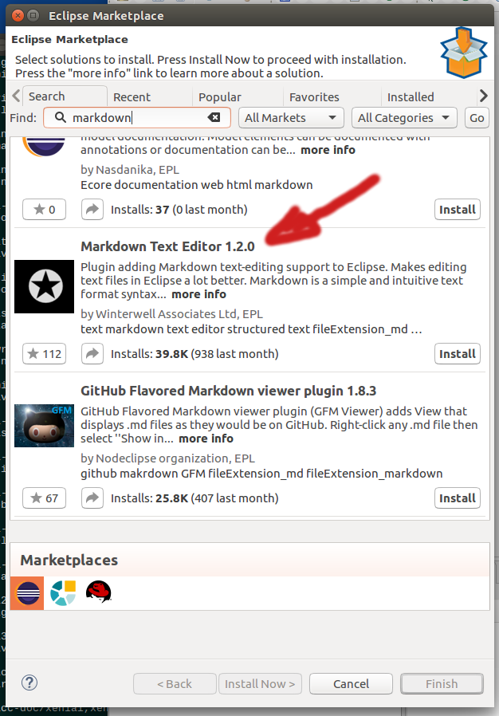

# Eclipse Odds and Ends

This document is an accumulation of notes about Eclipse with C/C++ for 64 bit Linux, in no particular order. 

### Installation ###
 
The easiest thing to do, is to go to [https://www.eclipse.org/downloads/](https://www.eclipse.org/downloads/) and follow the links to download the 64-bit "Oxygen" release.

The file which is downloaded to your "Downloads" folder, will be named something like **eclipse-cpp-oxygen-3-rc3-linux-gtk-x86_64.tar.gz**.  (The "rc3" means Oxygen release 3).

I extracted this file under my "/opt" directory (as superuser):

~~~
$ sudo su
<password>
# cd /opt
# tar -xzvf ~akelly/Downloads/eclipse-cpp-oxygen-3-rc3-linux-gtk-x86_64.tar.gz 
... lots of output ...
# ln -s /opt/eclipse/eclipse /usr/bin/eclipse
~~~

### Prerequisite: Java ###

If Java JDK of a sufficient revision level is already installed on your system, then you're done (see the eclipse release notes and documentation to find out what that is at the time of your installation).

If not, I typically get my Java (JDK) from Oracle, and install it under /usr/local, then set shell environment variables to let applications know where it is. 

Go to [http://www.oracle.com/technetwork/java/javase/downloads/index.html](http://www.oracle.com/technetwork/java/javase/downloads/index.html) and follow the links for the latest stable release.  For me, in this case, it was Java SE 9.0.4.  Find the "JDK Download" links, and follow them to what is currently the **Java SE Development Kit 9 Downloads** page.

There, choose the Linux .tar.tgz archive, and click. 

At this time, this file is **jdk-9.0.4_linux-x64_bin.tar.gz**.

Installation is simple.  As superuser:

~~~
# cd /usr/local
# mkdir -p java
# cd java
# tar -xzvf ~akelly/Downloads/jdk-9.0.4_linux-x64_bin.tar.gz 
~~~

And we're almost there.

Lastly, we have to add and export the $JAVA_HOME variable to our shell environment, and add the jdk bin folder to our path.

Under ubuntu 16.04, the best place to do this, is where the shell gets initialized every time it starts running.  As superuser:

~~~
# cd /etc/profile.d
# vi oracle-java.sh    # use your favorite editor - this will be a new file.
~~~

With your editor, enter the following lines, tailoring them to your system's specific paths and the java version you downloaded (if different than what is shown above):

~~~
JAVA_HOME='/usr/local/java/jdk-9.0.4'
export JAVA_HOME

PATH=${JAVA_HOME}/bin:${PATH}
export PATH
~~~

**You will have to log out of your terminal session, and back into it** before you see the JAVA_HOME variable in your environment, and in your PATH variable.  (Just sourcing .profile and/or .bashrc will not be enough). 

This mechanism is executed for all users, not just root or superuser. 

### Recommended Plugins ###

**Markdown Editor**

The plugin I've used here recently is **Markdown Text Editor**.  This document is being written using eclipse with this plugin. 

With eclipse running, click on the "Help" menu on top, and pick "Eclipse Marketplace...".  In the dialog box that opens, type "markdown" into the "Find: " field.  You should see a list of choices that look like this: 

Click the "Install" button for the plugin you want to install.  After installation of **Markdown Text Editor**, the installation process restarted eclipse. 

Past that point, editing files with the ".md" extension in eclipse involve the plugin (check out the ctrl^shift^{ key sequence to split the screen into two panes, showing a markdown source tab, and the preview tab.

**Markdown Viewer Extension for Chrome**

[Chrome Extenstion Menu](images/mdextension-chrome-image7.png "Get this from the Chrome \(Settings --> More tools --> Extensions\) )
